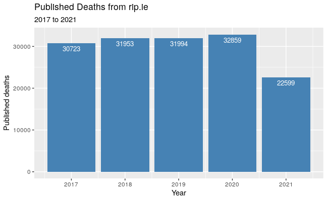

```{r setup, include=FALSE}
knitr::opts_chunk$set(echo = FALSE)
```

## Has Covid-19 increase the national death rate?

#### Information from different sources says diffenent things

But whats the truth?

The data is sourced from RIP.ie and the CSO.


## Popular First Names


## Popular Surnames


##  Annual Death Rate
2021 is 66 % of the way through the year, but 70% of 2020 death rate



## Slide with R Output

```{r cars, echo = TRUE}
summary(cars)
```

## Slide with Plot

```{r pressure}
plot(pressure)
```

